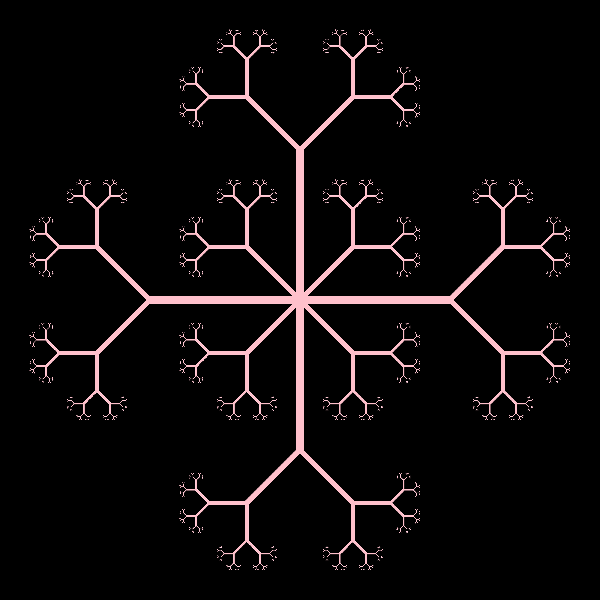

# Fractal Tree Generator

A fractal tree renderer written in C that generates symmetric tree patterns using recursive algorithms.



## What This Does

This program generates fractal trees by recursively drawing branching patterns. Starting from a central point, it creates 8 trees forming a symmetric mandala-like pattern.

### Key Features
- **Recursive branching** - Each branch splits into two smaller branches
- **Configurable parameters** - Control depth, angle, and thickness
- **Variable thickness** - Branches taper naturally (thicker trunks → thinner branches)
- **High resolution** - 3200×3200 pixel output
- **Custom colors** - Pink/purple gradient (RGB: 255, 192, 203)

## Requirements

### Compiler
- GCC (GNU Compiler Collection)
- Math library support (`-lm` flag)

### External Tools (Optional)
- ImageMagick's `convert` command for PNG output

## Quick Start

### Compile
```bash
gcc tree.c -o tree -lm
```

### Run
```bash
./tree
```

### Output
- `output.ppm` - PPM image format (uncompressed)
- `output.png` - PNG format (if ImageMagick installed)

## Configuration

Edit these constants in `main()` to customize:

```c
float theta = M_PI / 4.0;    // Branching angle (45 degrees)
int depth = 8;               // Recursion depth (8 levels)
int init_thickness = 20;     // Starting trunk thickness (20 pixels)
```

### Parameter Guide

| Parameter | Range | Effect |
|-----------|-------|--------|
| `theta` | 0 to π/2 | Angle between branches. Smaller = narrow tree, Larger = bushy tree |
| `depth` | 1 to 12 | Number of branching levels. Higher = more detail but slower |
| `init_thickness` | 1 to 50 | Starting trunk width in pixels |

## How It Works

### Coordinate System

The program uses a **mathematical coordinate system** mapped to pixels using the _calc_pixel() function:

```
Math Coordinates [-1, 1]       Screen Coordinates [0, 3199]
        
    y=1  (top)                      y=0 (top)
      ↑                               ↑
      |                               |
x=-1 ←+→ x=1            x=0 ←---------+--------→ x=3199
      |                               |
      ↓                               ↓
    y=-1 (bottom)                   y=3199 (bottom)
```

**Conversion Formula:**
```c
pixel_x = (x + 1) * 0.5 * (WIDTH - 1)
pixel_y = (1 - (y + 1) * 0.5) * (HEIGHT - 1)
```

Note: Y-axis is **flipped** (math Y increases upward, pixel Y increases downward)

### Recursive Algorithm

```
draw_tree(start, end, angle, depth, thickness):
    1. Draw line from start to end with given thickness
    2. If depth = 0, STOP
    3. Calculate direction angle of current branch
    4. Create two child branches:
       - Left branch: rotates +angle
       - Right branch: rotates -angle
       - Both have length = parent_length / 2
       - Both have thickness = parent_thickness × 0.7
    5. Recursively draw left branch (depth - 1)
    6. Recursively draw right branch (depth - 1)
```

**Branching Factor:** Each branch creates 2 children  
**Total Branches:** 2^depth (depth=8 → 256 terminal branches per tree)

### Line Drawing with Thickness

For each point along a line, draws a **filled circle** of radius `thickness`:

```c
for each point (x, y) on line:
    for each offset (dx, dy) in [-thickness, thickness]:
        if dx² + dy² ≤ thickness²:
            draw_pixel(x + dx, y + dy)
```

This creates smooth, anti-aliased looking thick lines.

## Math

### Polar to Cartesian Conversion
```c
x = center_x + length × cos(angle)
y = center_y + length × sin(angle)
```

### Angle Calculation
```c
angle = atan2(dy, dx)  // Returns angle of vector (dx, dy)
```

### Self-Similarity
Each branch is a **scaled-down replica** of the entire tree:
- Length ratio: 0.5 (half the parent)
- Thickness ratio: 0.7 (70% of parent)
- Same branching angle throughout

This creates **fractal** properties - infinite detail at all scales!

**Complexity:**
- Time: O(WIDTH × HEIGHT × 2^depth)
- Space: O(WIDTH × HEIGHT × 3 bytes)

**Concepts Used:**
- Recursion
- Fractal geometry
- Coordinate geometry

**Created with:** Pure C, Math, and Recursion  
**No external libraries** (except standard C library and math.h)